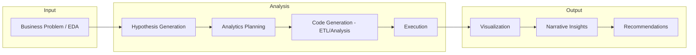

# Agentic Analytics: Vision & Platform Recommendation

**A vision document for enterprise-grade, analyst-augmenting analytics—reducing noise, democratizing insights, and enabling insights on demand.**

---

## Executive Summary

**Agentic Analytics** is the capability for an AI-augmented system to operate like an effective, top-tier business analyst: from understanding the business problem and exploring data, through hypothesis generation and analytics execution, to narrative insights and actionable recommendations—with minimal human or technical hand-holding.

This document clarifies the **role** of agentic analytics (what it is and is not), the **problems** it solves, **current-state limitations** (dashboards, human bandwidth), and a **future state** built on context, strong analytics, intelligent alerts, and enterprise control (BYOM, BYOK, data-agnostic design). It then assesses leading platforms against these requirements and **recommends an ideal architecture** that favors **modularity, vendor independence, and a platform such as TextQL** (or a comparable agentic analytics layer) over locking the entire stack into a single vendor such as Databricks.

**Executive-friendly expectations:**

| Dimension | Today (Current State) | Tomorrow (Agentic Analytics) |
|-----------|------------------------|-----------------------------|
| **Insight access** | Gated by technical teams and BI queues | Self-serve, on-demand for business and leadership |
| **Signal vs. noise** | Dashboards and reports create volume; actionability is low | Focus on leading indicators, anomalies, and narrative recommendations |
| **Data sprawl** | Data silos make it impossible for end-to-end insights | Agentic analytics will enable cross–data-warehouse insights |
| **Costs & risk** | Enterprises investing in large cloud data migration efforts to unlock value, leading to high migration costs and lock-ins | Agentic Analytics eliminates the need for data centralization |
| **Compliance** | Often cloud-only, shared tenancy | On-prem / self-host options; HIPAA-friendly; BYOM/BYOK |
| **Democratization** | Knowledge silos; SMEs as bottlenecks | Documentation → knowledge graphs; insights available across personas |

---

## 1. What Is Agentic Analytics?

Agentic analytics **augments or operates like a high-performing business analyst**. It does not replace the need for data scientists on advanced modeling; it focuses on the **data analyst, business analyst, and advanced analyst / statistician** workflow: turning business questions into hypotheses, plans, code (ETL/analysis), execution, visualization, and narrative recommendations.

The end-to-end value chain it aims to cover:

```
Business Problem / EDA  →  Hypothesis Generation  →  Analytics Planning  →  Code (ETL/Analysis)
        →  Execution  →  Visualization  →  Narrative Insights  →  Recommendations
```

An ideal platform performs this chain with **minimal human or technical input**—going beyond “notebook code generation” (e.g., Cursor, Databricks Data Science Agent) to **hypothesis generation, planning, execution, and compilation of business narrative**.

---

## 2. The Business Analyst Value Chain (Visual)

Agentic analytics mimics the business analyst workflow. The following diagram summarizes how an ideal system moves from problem to recommendation.



**Key assumptions:** The platform is already provided data locations, enterprise context, data documentation, ontologies / knowledge graphs, leading indicators, and enterprise strategy.

**What each stage implies for a platform:**

| Stage | Platform expectation |
|-------|----------------------|
| **Business Problem / EDA** | Where any technical and/or non-technical user across varying degree of enterprise experience should be able to initiate data research for decision making. This is user input and not something the platform is expected to solve. |
| **Hypothesis Generation** | Proposes testable hypotheses from the question and context—not just one-off queries. |
| **Analytics Planning** | Plans multi-step analysis (which datasets, metrics, segments, time windows). |
| **Code (ETL/Analysis)** | Generates and runs SQL and/or analytical code in a governed, auditable way. |
| **Execution** | Runs against live or approved data sources without requiring manual export or copy-paste. |
| **Visualization** | Produces charts/tables suitable for decision-making. |
| **Narrative Insights** | Summarizes findings in business language with caveats and confidence. |
| **Recommendations** | Suggests next steps, alerts, or actions (and can push these to channels). |

---

## 3. Current State vs. Future State

### 3.1 Current State & Limitations

| Area | Current state | Limitations |
|------|----------------|-------------|
| **Dashboards & BI** | Central way to consume metrics; many dashboards per domain. | High volume, low signal; “dashboard sprawl”; reliance on users to interpret and act. |
| **Human bandwidth** | Analysts and SMEs are the bridge between data and decisions. | Bottlenecks; knowledge silos; slow turnaround; only some personas get deep insights. |
| **Platform concentration** | Single platform (e.g., Databricks) for data, compute, notebooks, and sometimes “AI/BI.” | Lock-in; migration cost; single point of failure; cost growth; not always ideal for non-technical or leadership personas. |
| **Data sprawl** | Multiple warehouses, lakes, and sources. | Value delayed until migration completes; no unified, agnostic analytics layer. |
| **Compliance & control** | Often SaaS-only; shared tenancy. | Harder to meet on-prem, HIPAA, or “bring your own model” requirements. |

### 3.2 Future State: Agentic Analytics

| Area | Future state | Benefit |
|------|--------------|---------|
| **Signal over noise** | Focus on leading indicators, anomalies, and narrative insights instead of raw dashboard consumption. | Fewer, more actionable outputs. |
| **Insights on demand** | Business and leadership get answers in real time via natural language and self-subscription. | Reduced dependency on technical teams. |
| **Democratized insights** | Documentation and context become knowledge graphs/ontologies; non-technical users participate; technical users bring their own knowledge graphs. | Breaks silos; scales analyst-like capability. |
| **Modular & agnostic** | Analytics layer is decoupled from a specific warehouse or vendor. | Lower migration cost; flexibility in data platform and compute. |
| **Enterprise control** | On-prem / self-host options; BYOM; BYOK; whitelabeling for client reporting. | Security, compliance (e.g., HIPAA), and commercial reuse (e.g., data products, upselling). |

---

## 4. Platform Requirements for Agentic Analytics

For an ideal setup, the following components are required.

| # | Component | Description |
|---|-----------|-------------|
| 1 | **Context** | Enterprise connects into existing knowledge centers (Confluence, SharePoint, GitHub, Atlassian, Collibra, knowledge graphs, ontologies) or creates new knowledge that was previously missing. Platform is expected to generate new ontologies or leverage BYOK (Bring your own knowledge graphs). |
| 2 | **Strong analytics layer** | Hypothesis generation + execution with minimal human/technical input; goes beyond notebook code generation. |
| 3 | **Intelligent alerts & distribution** | Ability to push insights via multiple channels (chat, email, PPT, etc.). Ability for the platform to suppress stale or non-actionable insights. Reduce cognitive load by improving signal-to-noise ratio. |
| 4 | **Whitelabeling** | Support for data sales, client reporting, and upselling (e.g., branded reports, client-facing portals). |
| 5 | **Bring your own model (BYOM)** | Use of enterprise-approved, hosted LLMs (on-prem or approved cloud). |
| 6 | **Reduce dashboard clutter** | Shift from “more dashboards” to curated signals and narrative insights. |

Additional architectural expectations:

- **Data-warehouse agnostic**: Works across Snowflake, BigQuery, Redshift, Databricks, and others, as well as on-prem legacy data stores (e.g., Oracle, SQL data warehouses), to handle data sprawl today.
- **Bring your own knowledge graph (BYOK)**: Technical users can plug in existing ontologies/knowledge graphs; non-technical users can benefit from docs-to-knowledge-graph flows.
- **On-prem / self-host option**: For security, data residency, and HIPAA compliance.

---

## 5. Personas of Interest

| Persona | Role of agentic analytics | Needs |
|---------|----------------------------|--------|
| **Business / data analyst** | Primary “user” of the augmented workflow: hypothesis → plan → code → execution → narrative → recommendations. | Strong analytics layer, context (docs + KG), and export/alerting. |
| **Non-technical business user** | Ask questions in natural language; consume insights and recommendations. | Documentation → knowledge graphs/ontologies; no code; self-serve. |
| **Technical user / advanced analyst** | Deeper control: plug in own knowledge graphs (BYOK), refine analyses, validate robustness. | BYOK, code visibility, evaluation of insights for accuracy and robustness. |
| **Leadership** | Self-subscribe to topics; receive real-time or near real-time insights and alerts. | Alerts (chat, email, PPT); concise narratives; leading indicators. |

**Clarification:** Agentic analytics targets the **data analyst, business analyst, and advanced analyst / statistician**—not the core data scientist role (e.g., custom ML model development). Data scientists may still use the platform for exploration and ad-hoc analysis, but the product focus is analyst augmentation.

---

## 6. Problems Agentic Analytics Solves

1. **Democratize insights** – Reduce reliance on technical teams for routine analysis; enable business users and leadership to get answers.
2. **Break knowledge silos** – Surface SME knowledge via documentation and knowledge graphs so it is reusable across the organization.
3. **Reduce single-platform dependency** – Avoid concentrating data, knowledge, and analytics on one vendor to lower lock-in, migration cost, and single point of failure.
4. **Keep migration options open** – Modular design so that future data platform or compute changes are lower cost.
5. **Security and compliance** – On-prem / self-host options to reduce data loss risk and support HIPAA and similar regimes.
6. **Handle data sprawl** – Generate value across warehouses and sources today, without waiting for a multi-year data migration.
7. **Reduce reliance on traditional BI** – Shift from dashboard-centric consumption to narrative, on-demand insights and reduce dashboard sprawl.
8. **Unlock new value** – Enable cross–data-warehouse and cross-source analytics without requiring full data centralization first.

---

## 7. Tools in Scope

The following tools and features are considered in the platform assessment (agentic or agentic-adjacent analytics platforms in the industry):

- **Tableau** – Next-generation AI features (NLQ, explainers, etc.)
- **Power BI** – Copilot and embedded analytics
- **Databricks** – Agentic solutions (Genie, Data Science Agent, Deep Research)
- **TextQL** – Ana (AI data analyst), ontology, multi-source, Slack/API/embed
- **WisdomAI** – Conversational analytics, dynamic dashboards, proactive monitoring, enterprise context layer
- **ThoughtSpot** – Agentic analytics platform; AI agents, Analyst Studio, semantic modeling (SpotterModel)
- **Tellius** – Agentic analytics for enterprise data; NL interface, automated root cause analysis, agentic workflows
- **IBM watsonx BI** – AI-powered analyst; natural language query, step-by-step reasoning, intelligent alerts, predictive capabilities
- **Push.ai** – Agentic analytics combining quantitative metrics with qualitative context (transcripts, documents); cited answers, Slack/Teams
- **AgenticBI** – Conversational analytics (early access); multiple data sources, AI agents for summarization, anomalies, recommendations

---

## 8. Platform Assessment

The following tables assess all tools in scope (Section 7). **Tableau**, **Power BI**, **Databricks**, and **TextQL** are highlighted below as primary platforms for comparison.

### 8.1 Requirements Alignment (BYOK, BYOM, Data Agnostic, etc.)

| Requirement | **Tableau (Next AI)** | **Power BI + Copilot** | **Databricks (Genie / DSA / Deep Research)** | **TextQL (Ana)** | WisdomAI | ThoughtSpot | Tellius | IBM watsonx BI | Push.ai | AgenticBI |
|-------------|------------------------|-------------------------|-----------------------------------------------|------------------|----------|-------------|---------|----------------|---------|-----------|
| **Context (docs, KG, leading indicators)** | Semantic model / metadata; limited KG | Semantic model; Copilot context | Genie spaces, Unity Catalog; strong if all on DBX | Ontology; multi-source; docs/semantic layers | Enterprise context layer; semantic/DBT/catalogs | SpotterModel; semantic modeling; AI agents | Metrics, documents, conversations | NL + reasoning; semantic layer | Quantitative + qualitative (transcripts, docs); cited answers | Multi-source; NL; early access |
| **Hypothesis + execution (beyond code gen)** | Limited to semantic model & NLQ | Copilot over semantic model | DSA/Genie Agent; strong when data in DBX | Ana: multi-step analysis, code exec, ontology | Proactive monitoring; NL analytics; cross-source | AI agents; live, explainable insights | Automated root cause; agentic workflows | Step-by-step reasoning; predictive | Governed attributes; cross-source answers | Summarization; anomalies; recommendations |
| **Alerts / multi-channel (chat, email, PPT)** | Alerts; subscriptions; export | Alerts; Power Automate; export | Notifications; integration possible | Slack; API; embed; Playbooks (scheduled) | Alerts; export to Slides/PPT | Workflow embedding; live insights | Actions from insights | Intelligent alerts; dashboards | Slack; Teams | In-app; verify roadmap |
| **Whitelabeling (client reporting, upselling)** | Embed; branding options | Embed; white-label possible | Primarily internal analytics | Embed; API; flexible for client-facing use | Enterprise; client-facing use cases | Embed; SaaS/cloud | Embed; enterprise | IBM ecosystem | Slack/Teams integration | Early access; verify |
| **BYOM (enterprise LLM)** | Limited / roadmap | Copilot model choice constrained | Model serving on DBX; vendor-bound | Model-agnostic; multiple providers; configurable | Enterprise model options (verify per deployment) | Vendor/cloud model options | Verify per deployment | watsonx model stack | Verify per deployment | Verify (early access) |
| **Reduce dashboard noise** | Dashboards central | Dashboards central | Genie shifts to NL; dashboards still present | Ontology + NL; narrative focus; Playbooks | Proactive signals; NL; reduced dashboard dependency | Agentic NL; live insights in workflows | NL; automated analysis | NL; personalized metrics; alerts | Narrative + cited answers | Conversational; reduced dashboard focus |
| **Data-warehouse agnostic** | Connectors to many; semantic layer | Many connectors; semantic layer | **Best when data lives in Databricks** | Snowflake, BigQuery, Redshift, Databricks, semantic layers | Snowflake, BigQuery; cross-source | Broad connectors; cloud warehouses | Enterprise data; multi-source | IBM and major cloud sources | Multi-source; structured + unstructured | SQL, NoSQL, SaaS APIs |
| **BYOK (bring your own knowledge graph)** | Limited | Limited | Genie spaces; DBX-centric | Ontology; can ingest/align to external KG | Context layer; semantic/DBT; structured context | Semantic layer (SpotterModel) | Limited / semantic layer | Semantic layer | Context as governed attributes | Limited (early access) |
| **On-prem / self-host** | Limited / specific offerings | Limited | VPC / managed; full on-prem complex | **On-prem & self-hosted available** | Enterprise; HIPAA; deployment options | Cloud; on-prem options (verify) | Verify per deployment | IBM on-prem / hybrid options | Verify per deployment | Early access |

*Summary:* Among the **highlighted platforms**, **TextQL**, **Tableau**, and **Power BI** (with semantic layers) align well with data agnosticism and broad persona coverage; **Databricks** is powerful when the entire pipeline is on the platform but weak on agnosticism and creates vendor lock-in. WisdomAI, ThoughtSpot, Tellius, IBM watsonx BI, Push.ai, and AgenticBI offer complementary agentic or NL-driven analytics; fit depends on BYOM/BYOK, deployment, and data-source requirements.

### 8.2 Persona Alignment

| Persona | **Tableau (Next AI)** | **Power BI + Copilot** | **Databricks (Genie / DSA)** | **TextQL (Ana)** | WisdomAI | ThoughtSpot | Tellius | IBM watsonx BI | Push.ai | AgenticBI |
|---------|------------------------|-------------------------|------------------------------|------------------|----------|-------------|---------|----------------|---------|-----------|
| **Business / data analyst** | Good for governed self-serve on existing semantic model | Good with Copilot over semantic model | Strong for technical analysts on DBX | Strong: threads, code visibility, ontology, multi-step | Strong: NL, dashboards, export | Strong: Analyst Studio; semantic modeling | Strong: NL; root cause; agentic workflows | Good: NL; reasoning; predictive | Good: cited answers; cross-source | Good: NL; multi-source (early access) |
| **Non-technical business user** | Good if trained on semantic model | Good with Copilot | Steep learning curve; Genie helps but DBX-centric | Strong: NL, Slack, embed; no SQL | Strong: NL, proactive alerts | Strong: NL; live insights in workflows | Good: NL; ChatGPT-like interface | Good: NL; step-by-step reasoning | Good: Slack/Teams; narrative answers | Good: conversational (early access) |
| **Technical user / BYOK** | Limited | Limited | Good within DBX (spaces, catalog) | Strong: ontology; BYOK; code and refinement | Good: context layer; DBT/catalogs | Good: SpotterModel; semantic layer | Verify | Semantic layer; IBM stack | Governed attributes; context | Limited (early access) |
| **Leadership (self-serve, real-time)** | Dashboards + subscriptions | Dashboards + Copilot | Genie possible; often requires analyst mediation | Strong: Playbooks, Slack, embed; concise narratives | Strong: proactive monitoring; PPT/Slides export | Good: live insights in workflows | Good: automated insights → actions | Good: intelligent alerts; personalized metrics | Good: Slack/Teams; cited narratives | Verify (early access) |

*Summary:* Among the **highlighted platforms**, **TextQL**, **Tableau**, and **Power BI** align well across business, non-technical, and leadership personas; **Databricks** is strongest for technical analysts already on the platform. ThoughtSpot, Tellius, IBM watsonx BI, Push.ai, and AgenticBI extend coverage for NL-driven and agentic use cases; evaluate per persona and deployment needs.

---

## 9. Why Over-Reliance on Databricks Is Not Ideal

Databricks offers a strong integrated stack (data, compute, Genie, Data Science Agent, Deep Research). However, **concentrating data, knowledge, and agentic analytics entirely on Databricks** creates risks that matter to business and leadership:

| Risk | Impact |
|------|--------|
| **Single point of failure** | Outages or policy changes affect storage, compute, and analytics in one go. |
| **Long-term cost** | Consumption-based pricing and lock-in can lead to rising costs and limited leverage in negotiations. |
| **Migration cost** | Moving off Databricks later means moving data, pipelines, and “knowledge” (e.g., Genie spaces) at once—expensive and slow. |
| **Persona fit** | Genie and agent features are optimized for users already in the Databricks workspace; business and leadership often prefer lighter, channel-native experiences (Slack, email, embed). |
| **Data sprawl** | Many enterprises have multiple warehouses (Snowflake, BigQuery, Redshift). A DBX-centric design either forces migration or leaves value on the table. |
| **Compliance and BYOM** | Although Databricks supports custom models, the overall stack is vendor-tied; on-prem and “bring your own everything” are harder than with a modular, analytics-layer-focused vendor. |

**Recommendation:** Use Databricks where it clearly wins (e.g., Spark-based data engineering, ML workloads), but **do not** make it the only place for agentic analytics, knowledge graphs, or business insight delivery. Prefer a **data-warehouse agnostic, modular agentic analytics layer** that can sit on top of any warehouse (including Databricks) and that supports BYOM, BYOK, and on-prem options.

---

## 10. Recommendation: Ideal Architecture

### 10.1 Recommended Direction

- **Agentic analytics layer:** Prefer a **platform such as TextQL** (or a comparable alternative that meets the criteria below) as the primary agentic analytics engine, based on:
  - **Data-warehouse agnostic** connectivity (Snowflake, BigQuery, Redshift, Databricks, semantic layers).
  - **BYOM** and **on-prem / self-host** options for security and compliance.
  - **Ontology-centric** design that supports BYOK and unified context across sources.
  - **Persona coverage**: analysts (code visibility, multi-step), business users (NL, Slack, embed), leadership (Playbooks, alerts).
  - **Modularity**: can be replaced or complemented without moving the entire data platform.

  *WisdomAI* is a close alternative with a strong enterprise context layer, proactive monitoring, and HIPAA; evaluate alongside TextQL for governance and deployment requirements.

- **Data platform & compute:** Keep **deliberately decoupled** from the agentic analytics layer:
  - Use **best-fit warehouse(s)** per use case (Snowflake, BigQuery, Redshift, Databricks, etc.) and expose them via a **semantic layer** (e.g., Cube, Looker, dbt semantic layer) where useful.
  - Use **compute** (e.g., Databricks, Snowpark, BigQuery, EMR) for ETL and heavy analytics where each platform excels, not as the only place for “insight delivery.”

- **Knowledge graphs & ontologies:**  
  - Prefer a **platform that can build and consume ontologies** (e.g., TextQL’s Ontology) and/or **accept BYOK** so that technical teams can plug in existing knowledge graphs.  
  - Support **documentation-to-knowledge** flows for non-technical users so that enterprise context is captured once and reused.

### 10.2 Ideal Stack (Summary)

| Layer | Recommendation |
|-------|----------------|
| **Agentic analytics** | **TextQL** (or comparable: e.g., WisdomAI)—agnostic, BYOM, BYOK, on-prem, multi-persona. |
| **Data platform** | **Warehouse-agnostic**: choose by workload (Snowflake, BigQuery, Redshift, Databricks); avoid single-vendor lock-in for all data. |
| **Compute (ETL / heavy analytics)** | Use existing or best-fit engine (Databricks, Snowpark, etc.) for pipelines; do not mandate that agentic analytics run only there. |
| **Knowledge / context** | Ontology or knowledge-graph layer (e.g., TextQL Ontology or BYOK) fed by documentation and semantic models. |
| **Channels** | Integrate agentic analytics with Slack, Teams, email, embed, and API for alerts and client-facing or whitelabel reporting. |

This architecture supports **insights on demand**, **reduced dashboard noise**, **democratized access**, and **lower long-term cost and risk** while remaining **modular and migration-friendly**.

---

## 11. Document Intent & Use

This document is intended to:

- **Clarify** the role of agentic analytics (analyst augmentation, not data science replacement) and the problems it solves.
- **Set executive expectations** for current vs. future state (noise reduction, on-demand insights, democratization).
- **Compare** leading platforms objectively on requirements and personas, with a **bias toward TextQL or a comparable platform** that is data-agnostic, supports BYOM/BYOK, and avoids single-vendor lock-in.
- **State clearly** that **Databricks in its current form is not ideal as the sole agentic analytics and knowledge platform** for the enterprise, due to lock-in, cost, single point of failure, and persona fit—while still valuing it where it excels (data engineering, compute).
- **Recommend** an **ideal data platform + compute + knowledge/ontology + agentic analytics** setup that is modular, secure, and future-proof.

You can adapt this vision for internal strategy, RFP criteria, or architecture reviews, and publish it to GitHub as a markdown artifact for versioning and collaboration.

---

*Document version: 2.0 — For review and publication as markdown on GitHub.*
